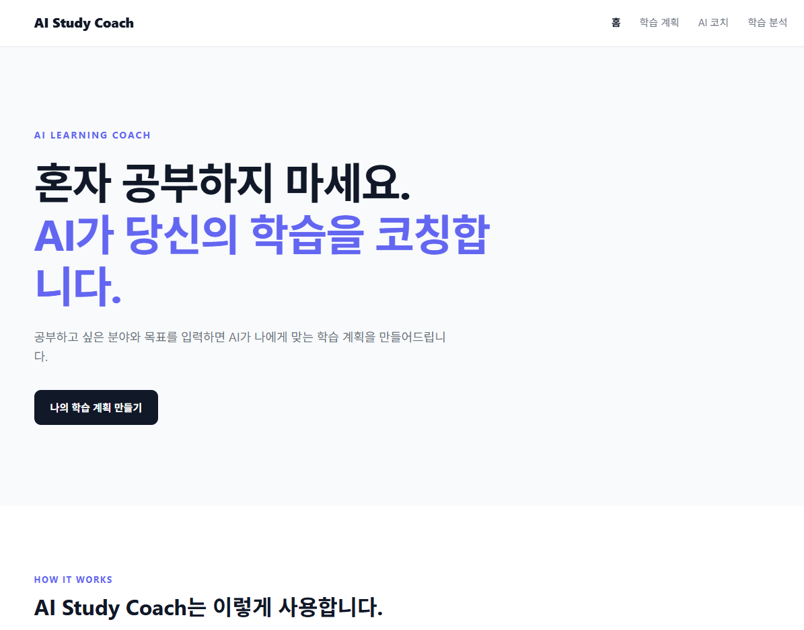
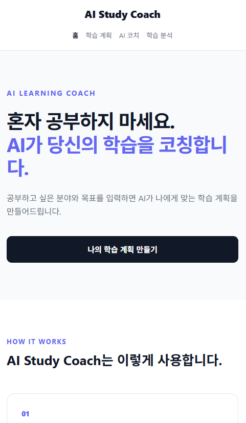
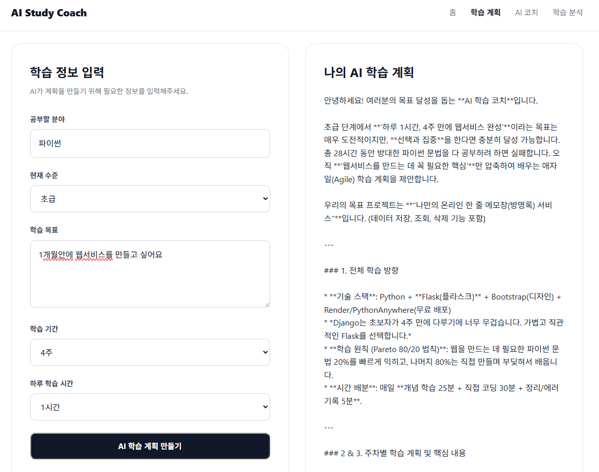
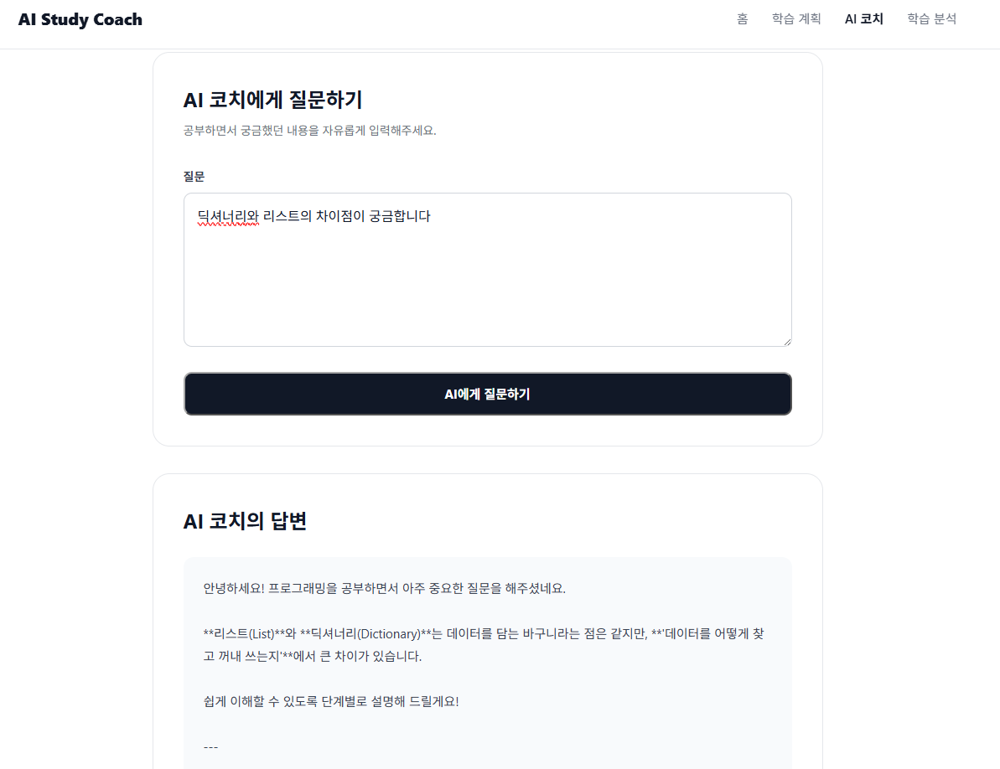
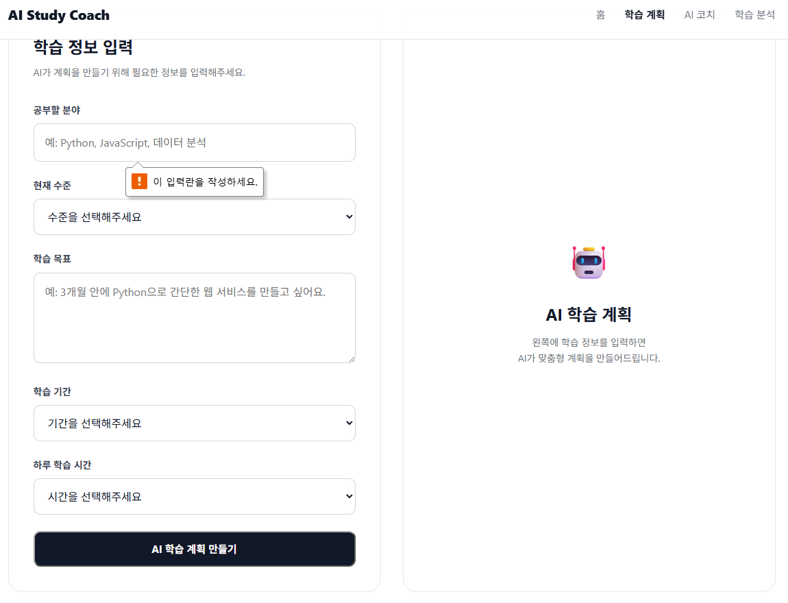
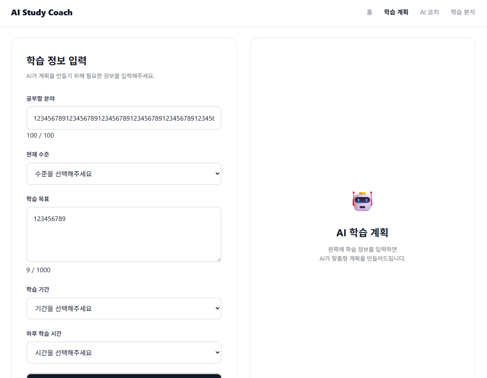
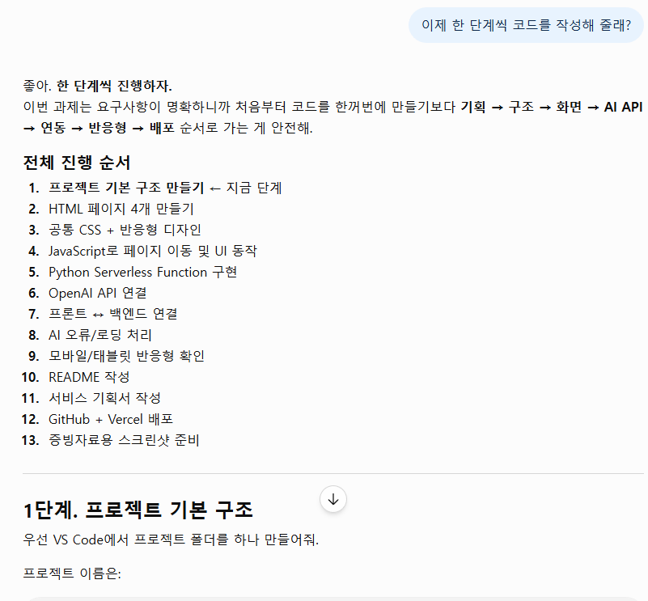

# codyssey_a1_3

AI Study Coach는 학습자가 자신의 학습 목표와 궁금한 내용을 입력하면 AI가 맞춤형 학습 계획과 학습 코칭을 제공하는 웹 서비스입니다.

순수 HTML, CSS, JavaScript로 프론트엔드를 구현하고, Python 기반 FastAPI 백엔드와 Gemini API를 연동하여 AI 기능을 제공합니다.

---

## 1. 서비스 소개

### 서비스 목적

학습자가 혼자 공부하면서 겪는 어려움을 줄이고, 자신의 수준과 목표에 맞는 학습 방향을 쉽게 설정할 수 있도록 돕는 것을 목적으로 합니다.

사용자가 학습 정보를 입력하면 AI가 학습 계획을 생성하고, 궁금한 내용을 질문하면 AI 학습 코치가 답변을 제공합니다.

### 타겟 사용자

* AI 및 프로그래밍을 공부하는 대학생
* 취업을 준비하는 학습자
* 새로운 기술을 독학하는 초보자
* 체계적인 학습 계획이 필요한 사용자

### 핵심 가치

* AI를 활용한 개인 맞춤형 학습 계획
* 학습 중 궁금한 내용을 바로 질문할 수 있는 AI 코치
* 학습 목표에 맞는 단계별 학습 방향 제공
* PC와 모바일에서 사용할 수 있는 반응형 웹 서비스

---

## 2. 주요 기능

### ① 학습 계획 생성

사용자가 다음 정보를 입력하면 AI가 맞춤형 학습 계획을 생성합니다.

**입력**

* 공부 분야
* 현재 수준
* 학습 목표
* 학습 기간
* 하루 학습 시간

**출력**

* 전체 학습 방향
* 주차별 학습 계획
* 핵심 학습 내용
* 실습 및 복습 방법
* 학습 시 주의사항

### ② AI 학습 코치

사용자가 공부하면서 궁금한 내용을 질문하면 Gemini API를 이용하여 AI가 답변합니다.

**입력 예시**

> Python에서 리스트와 튜플의 차이를 알려줘.

**출력**

* 개념 설명
* 간단한 예시
* 단계별 설명
* 다음에 공부하면 좋은 내용

### ③ 학습 분석

학습 분석 페이지를 통해 학습 내용을 확인하고 자신의 학습 방향을 점검할 수 있도록 구성했습니다.

---

## 3. 페이지 구성

| 페이지        | 설명                      |
| ---------- | ----------------------- |
| Home       | 서비스 소개 및 주요 기능 안내       |
| Study Plan | AI를 이용한 맞춤형 학습 계획 생성    |
| AI Coach   | 학습 관련 질문을 입력하고 AI 답변 확인 |
| Analysis   | 학습 내용을 확인하고 분석          |

페이지 상단 메뉴와 버튼을 통해 각 페이지를 이동할 수 있습니다.

총 4개의 페이지로 구성하여 과제의 최소 3개 페이지 요구사항을 충족합니다.

---

## 4. 기술 스택

### Frontend

* HTML5
* CSS3
* Vanilla JavaScript
* Fetch API
* 반응형 웹 디자인

### Backend

* Python
* FastAPI
* Pydantic

### AI

* Google Gemini API
* `google-genai`

### Deployment

* GitHub
* Vercel

---

## 5. 프로젝트 구조

```text
AI Study Coach/
│
├── index.html
├── coach.html
├── plan.html
├── analysis.html
│
├── css/
│   └── style.css
│
├── js/
│   ├── main.js
│   ├── coach.js
│   ├── plan.js
│   └── analysis.js
│
├── api/
│   └── index.py
│
├── requirements.txt
│
└── vercel.json
```

### Frontend / Backend 구분

**Frontend**

```text
index.html
coach.html
plan.html
analysis.html
css/
js/
```

사용자 화면과 입력 UI, 결과 표시 및 페이지 이동을 담당합니다.

**Backend**

```text
api/index.py
```

FastAPI를 이용하여 웹 페이지를 제공하고 AI API 요청을 처리합니다.

---

## 6. API 구조

### AI Coach

```http
POST /api/ai-coach
```

요청 데이터:

```json
{
  "question": "Python에서 리스트와 튜플의 차이를 알려줘."
}
```

성공 응답:

```json
{
  "success": true,
  "answer": "..."
}
```

### Study Plan

```http
POST /api/study-plan
```

요청 데이터:

```json
{
  "subject": "Python",
  "level": "초급",
  "goal": "Python 기초 문법 익히기",
  "duration": "4주",
  "daily_time": "1시간"
}
```

성공 응답:

```json
{
  "success": true,
  "plan": "..."
}
```

프론트엔드는 `fetch('/api/...')`를 사용하여 백엔드 API를 호출하고 AI 결과를 화면에 출력합니다.

---

## 7. AI 기능 처리 기준

### 입력 처리

필수 입력값이 비어 있는 경우 AI API를 호출하지 않고 사용자에게 안내 메시지를 표시합니다.

예:

```text
질문을 입력해주세요.
```

또는

```text
공부할 분야를 입력해주세요.
```

### API 오류 처리

Gemini API 호출 과정에서 오류가 발생하면 사용자에게 다음과 같은 메시지를 표시합니다.

```text
AI 코치 답변을 생성하지 못했습니다.
```

또는

```text
AI 학습 계획을 생성하지 못했습니다.
```

### API 키 미설정

환경 변수에 Gemini API 키가 설정되지 않은 경우 다음 메시지를 반환합니다.

```text
Gemini API 키가 설정되지 않았습니다.
```

### 로딩 처리

AI 응답을 기다리는 동안 화면에 로딩 상태를 표시하여 사용자가 요청이 처리되고 있음을 알 수 있도록 구성했습니다.

---

## 8. 환경 변수 설정

Gemini API를 사용하기 위해 `GEMINI_API_KEY` 환경 변수가 필요합니다.

### 로컬 환경

Windows PowerShell:

```powershell
$env:GEMINI_API_KEY="발급받은_API_키"
```

또는 `.env` 파일을 사용하는 경우 프로젝트 환경에 맞게 API 키를 설정합니다.

### Vercel

Vercel 프로젝트의

**Settings → Environment Variables**

에서 다음 변수를 추가합니다.

```text
Name: GEMINI_API_KEY
Value: 발급받은 Gemini API Key
```

API 키는 GitHub 저장소에 직접 작성하거나 공개해서는 안 됩니다.

---

## 9. 로컬 실행 방법

### 1. 저장소 클론

```bash
git clone 저장소_URL
cd "AI Study Coach"
```

### 2. 가상환경 생성

```bash
python -m venv venv
```

### 3. 가상환경 활성화

Windows:

```bash
venv\Scripts\activate
```

### 4. 패키지 설치

```bash
pip install -r requirements.txt
```

### 5. Gemini API 키 설정

```text
GEMINI_API_KEY=발급받은_API_키
```

### 6. Vercel 개발 서버 실행

```bash
vercel dev
```

실행 후 브라우저에서 로컬 주소로 접속합니다.

```text
http://localhost:3000
```

---

## 10. Vercel 배포 방법

### 1. GitHub 저장소 생성

프로젝트를 GitHub 저장소에 업로드합니다.

### 2. Vercel 연결

Vercel에서 GitHub 저장소를 Import하여 프로젝트를 연결합니다.

### 3. 환경 변수 설정

Vercel 프로젝트의 Environment Variables에 다음 값을 등록합니다.

```text
GEMINI_API_KEY
```

### 4. 배포

GitHub의 `main` 브랜치에 변경사항을 Push하면 Vercel에서 자동으로 배포됩니다.

배포가 완료되면 Vercel에서 제공하는 URL을 통해 서비스를 이용할 수 있습니다.

---

## 11. 배포 URL

**Vercel**

> [https://codyssey-a1-3-gamma.vercel.app/]


---

## 12. 반응형 웹

다양한 화면 크기에서 사용할 수 있도록 반응형 CSS를 적용했습니다.

확인 대상:

* Desktop
* Tablet
* Mobile

화면 크기에 따라 콘텐츠 영역, 버튼, 입력 폼 등의 크기와 배치를 조정하여 모바일에서도 사용할 수 있도록 구현했습니다.

---

## 13. 동작 흐름

### AI 학습 계획

```text
사용자
  ↓
학습 정보 입력
  ↓
프론트엔드 JavaScript
  ↓
POST /api/study-plan
  ↓
FastAPI
  ↓
Gemini API
  ↓
AI 학습 계획 생성
  ↓
JSON 응답
  ↓
화면에 결과 출력
```

### AI 학습 코치

```text
사용자
  ↓
질문 입력
  ↓
프론트엔드 JavaScript
  ↓
POST /api/ai-coach
  ↓
FastAPI
  ↓
Gemini API
  ↓
AI 답변 생성
  ↓
JSON 응답
  ↓
화면에 결과 출력
```

---

## 14. 증빙 자료

### 서비스 스크린샷

1. 데스크톱 메인 화면
<p align="center">

</p>

2. 모바일 메인 화면
<p align="center">

</p>

3. AI 학습 계획 생성 결과

<p align="center">

</p>

4. AI Coach 동작 화면

<p align="center">

</p>

5. 빈 입력 화면
<p align="center">

</p>

6. 긴 입력 화면
<p align="center">

</p>

### AI 코딩 도구 사용 증빙

* AI 코딩 도구와의 대화 로그
<p align="center">

</p>

---

## 15. 주의사항

* Gemini API Key는 GitHub에 업로드하지 않습니다.
* `.env` 등의 환경 설정 파일에 저장된 비밀 키는 `.gitignore`를 통해 관리합니다.
* AI가 생성하는 학습 계획은 참고용이며 사용자의 실제 학습 상황에 맞게 조정할 수 있습니다.
* API 사용량에 따라 Gemini API 사용 제한 또는 비용이 발생할 수 있습니다.
## API 키 유출 대응 및 예방

API 키가 GitHub 등에 실수로 노출된 경우 기존 키를 계속 사용하는 것이 아니라 **즉시 무효화하고 새로운 키로 교체**한다.

### API 키 유출 발생 시 대응 절차

1. **유출된 API 키 즉시 비활성화**

   * Gemini API 키를 관리하는 콘솔에서 유출된 키를 확인한다.
   * 해당 키를 즉시 폐기하거나 비활성화한다.

2. **새로운 API 키 발급**

   * 새로운 API 키를 생성한다.
   * 기존 키를 코드에 다시 사용하지 않는다.

3. **Vercel 환경 변수 교체**

   * Vercel 프로젝트의 환경 변수에서 기존 `GEMINI_API_KEY` 값을 삭제하거나 새로운 키로 변경한다.
   * 변경 후 새로운 배포를 진행한다.

4. **GitHub 저장소 확인**

   * GitHub의 Commit History와 파일 내용을 확인하여 API 키가 포함된 위치를 확인한다.
   * `.env` 등의 비밀키 파일이 Git에 올라가지 않았는지 확인한다.
   * 필요하면 노출된 키가 포함된 커밋을 정리한다.

5. **사용량 및 로그 확인**

   * Gemini API 사용량을 확인하여 비정상적인 API 호출이나 사용량 증가가 발생했는지 확인한다.
   * Vercel의 Runtime Logs와 배포 로그를 확인하여 의심스러운 API 요청이 있었는지 점검한다.

6. **서비스 정상 동작 확인**

   * 새로운 API 키를 적용한 후 AI 코칭과 학습 계획 기능이 정상적으로 동작하는지 테스트한다.

### 재발 방지

API 키가 다시 유출되지 않도록 다음 원칙을 적용한다.

* API 키를 소스 코드에 직접 작성하지 않는다.
* `.env` 파일을 `.gitignore`에 등록한다.
* GitHub에 `.env` 파일을 Commit하지 않는다.
* Vercel에서는 API 키를 환경 변수로 관리한다.
* 공개 저장소에 API 키가 포함된 코드를 Push하지 않는다.
* API 키를 문서, README, 스크린샷 등에 직접 노출하지 않는다.
* API 키가 노출되었다고 판단되면 사용 여부와 관계없이 즉시 폐기하고 교체한다.

### API 키 관리 흐름

```text
개발 환경
   ↓
.env에 API 키 저장
   ↓
.gitignore로 Git 추적 제외
   ↓
GitHub에는 코드만 Push
   ↓
Vercel 환경 변수에 API 키 설정
   ↓
배포된 서버에서 환경 변수 사용
```

### 유출 대응 흐름

```text
API 키 유출 발견
   ↓
기존 API 키 즉시 폐기
   ↓
새 API 키 발급
   ↓
Vercel 환경 변수 교체
   ↓
GitHub Commit 및 파일 확인
   ↓
Gemini 사용량 / Vercel 로그 확인
   ↓
재배포
   ↓
AI 기능 정상 동작 확인
```

---

## 16. 배포 문제 진단

### 배포 문제 진단 및 재배포

Vercel 배포가 실패하거나 배포 후 서비스에 문제가 발생한 경우 다음 순서로 원인을 확인한다.

### 1. Vercel 배포 상태 확인

Vercel 프로젝트의 **Deployments** 메뉴에서 가장 최근 배포의 상태를 확인한다.

* `Ready` : 배포 성공
* `Building` : 빌드 진행 중
* `Error` : 배포 실패

배포가 실패한 경우 오류가 발생한 배포 항목을 클릭하여 상세 화면으로 이동한다.

### 2. Build Logs 확인

배포 상세 화면에서 **Build Logs**를 확인한다.

다음과 같은 항목을 중심으로 오류를 확인한다.

* Python 패키지 설치 오류
* `requirements.txt` 관련 오류
* `api/index.py` 실행 오류
* 파일 또는 디렉터리 경로 오류
* 환경 변수 누락
* API 실행 과정에서 발생한 예외

특히 `GEMINI_API_KEY`와 같은 환경 변수가 정상적으로 설정되어 있는지 확인한다.

### 3. Runtime Logs 확인

배포 자체는 성공했지만 AI 코칭이나 학습 계획 생성 등 특정 기능에서 오류가 발생하는 경우 **Runtime Logs**를 확인한다.

Runtime Logs에서는 실제 API 요청 처리 과정에서 발생한 Python 예외와 AI API 호출 오류 등을 확인할 수 있다.

### 4. 수정 후 재배포

오류 원인을 수정한 후 다음 순서로 재배포한다.

1. 로컬에서 코드를 수정한다.
2. 로컬 환경에서 기능이 정상적으로 동작하는지 확인한다.
3. 수정한 코드를 GitHub에 `commit` 및 `push`한다.
4. GitHub와 연결된 Vercel 프로젝트에서 새로운 배포가 자동으로 시작되는지 확인한다.
5. **Deployments** 메뉴에서 새로운 배포의 상태를 확인한다.
6. `Ready` 상태가 되면 배포된 사이트에 접속하여 주요 기능을 다시 테스트한다.

### 5. Vercel에서 수동 재배포

GitHub 코드 수정 없이 기존 버전을 다시 배포해야 하는 경우 Vercel의 **Deployments** 메뉴에서 해당 배포를 선택한 후 **Redeploy** 기능을 사용할 수 있다.

재배포가 완료되면 `Ready` 상태인지 확인하고 서비스가 정상적으로 동작하는지 다시 확인한다.

### 배포 오류 확인 순서

```text
배포 실패
   ↓
Vercel Deployments 확인
   ↓
Build Logs 확인
   ↓
오류 원인 수정
   ↓
GitHub Commit & Push
   ↓
Vercel 자동 재배포
   ↓
Ready 상태 확인
   ↓
서비스 기능 테스트
```

배포는 성공했지만 특정 기능이 동작하지 않는 경우에는 다음 순서로 확인한다.

```text
기능 오류 발생
   ↓
Vercel Runtime Logs 확인
   ↓
API 오류 원인 확인
   ↓
코드 또는 환경 변수 수정
   ↓
GitHub Push
   ↓
Vercel 재배포
   ↓
AI 기능 재테스트
```

## 17. 응답 속도 및 비용 최적화

AI 코칭과 학습 계획 생성은 Gemini API를 호출하기 때문에 입력 내용과 API 상태에 따라 응답 시간이 달라질 수 있다. 현재 서비스는 사용자가 요청할 때만 AI API를 호출하는 **온디맨드 방식**으로 동작하여 불필요한 API 호출을 줄이도록 구성하였다.

추후 사용량 증가와 응답 지연에 대응하기 위해 다음과 같은 최적화 방법을 적용할 수 있다.

| 최적화 방법   | 응답 속도      | 비용 | 적용 방식                                 |
| -------- | ---------- | -- | ------------------------------------- |
| 경량 모델 사용 | 빠름         | 낮음 | 간단한 질문이나 짧은 학습 계획에 경량 모델 사용           |
| 입력 길이 제한 | 개선 가능      | 감소 | AI 코칭 1000자, 학습 분야 100자, 학습 목표 1000자로 제한 |
| 캐싱       | 매우 개선 가능   | 감소 | 동일하거나 유사한 요청의 결과를 재사용                 |
| 온디맨드 요청  | 불필요한 호출 감소 | 감소 | 사용자가 버튼을 눌렀을 때만 AI API 호출             |
| 프롬프트 최적화 | 개선 가능      | 감소 | 불필요한 지시와 출력 내용을 줄여 토큰 사용량 감소          |

### 비용과 성능의 트레이드오프

응답 속도를 높이기 위해 더 빠른 경량 모델을 사용하면 비용을 줄일 수 있지만, 복잡한 학습 계획이나 전문적인 질문에서는 답변의 품질이 낮아질 가능성이 있다.

반대로 더 높은 성능의 모델을 사용하면 복잡한 질문에 대한 답변 품질을 높일 수 있지만 응답 시간과 API 사용 비용이 증가할 수 있다.

따라서 본 서비스에서는 **간단한 질문에는 경량 모델을 사용하고, 복잡한 학습 계획에는 성능이 높은 모델을 사용하는 방식**으로 상황에 따라 모델을 선택하는 것을 향후 개선 방향으로 고려한다.

또한 동일한 요청에 대한 캐싱을 적용하면 API 호출 횟수를 줄여 비용을 절감할 수 있지만, 최신 정보가 필요한 요청에서는 오래된 결과가 반환될 수 있으므로 캐시 유효 시간을 적절하게 설정해야 한다.

### 현재 적용된 최적화

현재 서비스에는 다음과 같은 기본적인 비용 및 응답 관리 방법을 적용하였다.

* 사용자가 직접 요청한 경우에만 Gemini API 호출
* AI 코칭 질문을 최대 1000자로 제한
* 학습 분야를 최대 100자로 제한
* 학습 목표를 최대 1000자로 제한
* 불필요하게 긴 입력이 Gemini API로 전달되지 않도록 프론트엔드와 백엔드에서 입력값 검증

---

### 18. 향후 개선

사용량이 증가할 경우 다음 기능을 추가할 수 있다.

1. 요청 유형에 따른 경량/고성능 모델 분리
2. 반복 요청에 대한 캐싱 적용
3. API 호출 횟수 및 응답 시간 모니터링
4. 긴 응답을 제한하여 출력 토큰 절감
5. 요청 실패 시 불필요한 반복 호출을 방지하는 재시도 정책 적용

---

## 19. 프레임워크 도입 시 장단점 및 변경 범위

현재 서비스는 **Vanilla HTML/CSS/JavaScript + FastAPI** 구조로 구현되어 있다. 향후 서비스 규모가 커질 경우 프론트엔드 프레임워크를 도입하여 컴포넌트 재사용성과 상태 관리를 개선할 수 있다.

### 프레임워크 도입 비교

| 항목        | 현재 방식                 | 프레임워크 도입 시                            |
| --------- | --------------------- | ------------------------------------- |
| 개발 방식     | Vanilla HTML/CSS/JS   | React 등 프론트엔드 프레임워크                   |
| 장점        | 구조가 단순하고 별도 빌드 과정이 적음 | 컴포넌트 재사용, 상태 관리, 유지보수 편의성 향상          |
| 단점        | 페이지가 많아질수록 코드 중복 가능   | 학습 비용과 프로젝트 설정 및 빌드 과정 증가             |
| 초기 개발 난이도 | 낮음                    | 상대적으로 높음                              |
| 유지보수      | 소규모 서비스에 적합           | 대규모 서비스에 유리                           |
| 변경 범위     | 현재 구조 유지              | HTML → 컴포넌트 변환, JS 로직 이전, 빌드 환경 추가 필요 |
| 예상 추가 작업량 | 없음                    | 중간 수준의 추가 작업 필요                       |

### 마이그레이션 범위

React와 같은 프론트엔드 프레임워크를 도입할 경우 다음과 같은 작업이 필요하다.

1. 기존 HTML 페이지를 프레임워크의 컴포넌트 구조로 변경
2. `js/main.js`, `js/coach.js`, `js/plan.js`, `js/analysis.js`의 기능을 컴포넌트 및 상태 관리 방식으로 이전
3. 기존 CSS를 프레임워크 프로젝트에 맞게 정리
4. `package.json` 및 프론트엔드 빌드 환경 추가
5. 기존 FastAPI API(`/api/ai-coach`, `/api/study-plan`)와 프론트엔드의 연동 방식 재구성
6. Vercel 배포 설정 및 빌드 과정 수정
7. 기존 페이지와 AI 기능에 대한 동작 테스트 및 반응형 테스트 재진행

---

## 19. 향후 개선 사항

* 학습 기록 저장 기능
* 사용자별 학습 데이터 관리
* 학습 진행률 시각화
* AI 학습 계획 자동 수정 기능
* 학습 일정 알림 기능
* 사용자별 맞춤형 학습 피드백 강화